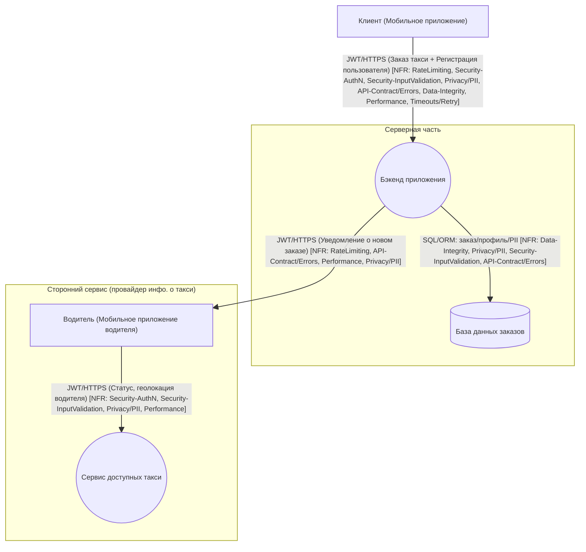

# TM - Требования безопасности + Модель угроз + ADR

> Этот файл - **индивидуальный**. Его проверяют по **rubric_TM.md** (5 критериев × {0/1/2} → 0-10).
> Подсказки помечены `TODO:` - удалите после заполнения.
> Все доказательства/скрины кладите в **EVIDENCE/** и ссылайтесь на конкретные файлы/якоря.

---

## 0) Мета

- **Проект (опционально BYO):** «учебный шаблон»
- **Версия (commit/date):**  v1.0.5 / 2025-10-12
- **Кратко (1-2 предложения):** Система заказа такси

---

## 1) Архитектура и границы доверия (TM1, S04)

- **Роли/активы:** пользователь (пассажир), пользователь (водитель); ПДн/токены/платёжные данные/модели …
- **Зоны доверия:** Internet (недоверенная), Internal (сервер/бэкенд, частично доверенная), Device (клиентские устройства, частично доверенные)
- **Доверенные компоненты:** серверная часть (бэкенд, БД) при условии соблюдения RBAC и политики доступа; внутренние сервисы с ограниченным доступом; админ-интерфейс с MFA и аудитом.
- **Недоверенные компоненты:** интернет-клиенты (мобильные приложения, браузеры), внешние интеграции (платёжные и такси-провайдеры), устройства пользователей (риск компрометации).
- **Внешние интеграции:** сервисы оплаты, сторонние API такси, SMS/email-провайдеры — считаются недоверенными, все входящие/исходящие данные валидируются и логируются.
- **Админ-доступ:** ограничен отдельной зоной, требует MFA, immutable audit log, доступ только из Internal сети.
- **Граница доверия (trust boundary):** проходит между интернетом и API gateway, между сервисами и внешними провайдерами, между клиентским устройством и сервером; все переходы через boundary требуют аутентификации, валидации и логирования.

- **Критичные интерфейсы и допущения:**  
  TODO: что считаем доверенным/недоверенным; внешние интеграции; админ-доступ; где проходит boundary

---

## 2) Реестр угроз STRIDE (TM2, TM3, S04)

| Element                              | Data/Boundary                        | Threat (S/T/R/I/D/E) | Description (1-2 строки)                                                | NFR link (ID)                           | Mitigation idea (ADR later)                       |
| ------------------------------------ | ------------------------------------ | -------------------- | ------------------------------------------------------------------------ | --------------------------------------- | ------------------------------------------------- |
| Edge: Internet → API (auth/login)    | JWT / credentials / public endpoint  | S                    | Кража/повтор токенов, brute-force логина                                  | NFR-202, NFR-305, NFR-101               | MFA, short JWT TTL + refresh, auth rate limits    |
| Edge: Internet → API (order submission)| DTO / order input                     | T                    | Подмена/манипуляция полей заказа (точки, цена, destination)               | NFR-206, NFR-205, NFR-302               | Strict input validation, server-side canonicalization |
| Edge: Internet → API (mass requests)  | requests / public API                 | D                    | Массовые запросы → перегрузка / DoS                                        | NFR-201, NFR-101, NFR-301               | Global + per-user rate limits, quotas, backpressure |
| Node: API Gateway/Controller         | Routing / logging / errors            | R                    | Нет/неполный аудит действий → спорные операции неотслеживаемы             | NFR-105, NFR-304                        | RFC7807 errors, correlation_id in logs, audit events |
| Edge: API → Service (DTO/requests)   | DTO / internal calls                  | T/I                  | Некорректные DTO/неканоничные поля приводят к логическим ошибкам/утечкам   | NFR-206, NFR-205, NFR-103               | Input schema validation, canonicalization, reject extra fields |
| Node: Service / Business logic       | Order processing / payments           | E/T                  | Эскалация привилегий через уязвимость в логике (создание/подмена ролей)    | NFR-202, NFR-205                        | RBAC checks, principle of least privilege, server-side checks |
| Edge: Service → Database (SQL/ORM)   | SQL/ORM / PII storage                 | T/I                  | SQL injection или запись неканоничных данных                              | NFR-205, NFR-306, NFR-103               | Parametrized queries, ORM best practices, DB constraints |
| Node: Database (storage)             | Persisted orders / profiles (PII)     | I                    | Доступ к PII/утечка из-за неправильных прав или бэкапа                    | NFR-103, NFR-303                        | Encryption at rest, access controls, retention policy ≤7d |
| Edge: Service → External Provider    | HTTP/gRPC calls to taxi provider      | D                    | Залипание/долгие ответы внешнего провайдера → деградация сервиса          | NFR-102, NFR-104                        | Timeouts ≤2s, retry with jitter, circuit-breaker |
| Edge: Service → Driver App (notify)  | Notifications (push/SMS/email)        | I/D                  | Утечка PII в уведомлениях; спам-авторы могут злоупотреблять отправкой      | NFR-101, NFR-103, NFR-104               | Rate-limit notifications, redact PII in messages, delivery status logging |
| Edge: API → Client (responses/errors) | API responses (errors / payloads)     | I/R                  | Подробные стэктрейсы в ошибках раскрывают внутреннюю структуру сервиса     | NFR-105, NFR-304                        | Hide stack traces, use RFC7807, include correlation_id only |
| Node: Logs / Observability           | Logs containing events / traces        | I/R                  | Логи содержат сырой PII или слишком подробные данные                       | NFR-103, NFR-105                        | PII masking, redact sensitive fields, log retention policy |
| Node: Service → Queue (optional)     | Events / async jobs                    | D/T                  | Очередь может быть заспамлена/подделана сообщение → DoS / tampering        | NFR-201, NFR-206                        | Authenticated producers, rate limits, message integrity (signatures) |
| Edge: Client device (lost/stolen)    | Stored tokens / cached PII on device   | S/I                  | Кража устройства → доступ к токенам/PII                                   | NFR-305, NFR-103                        | Short token TTL, device binding, remote session invalidation |
| Node: Admin operations               | Admin API / audit actions              | R/E                  | Отсутствие неизменяемого аудита → отказ в доказательствах; повышение прав   | NFR-105, NFR-302, NFR-303               | Immutable audit log, admin RBAC, approval workflows |
| Edge: Client → Payment Service | Payment data / API requests | I | Утечка данных платежных карт через логи или API-ответы | NFR-601, NFR-602 | PCI DSS compliance, маскирование данных карт | 
| Node: Payment Service | Payment methods storage | S/E | Неавторизованный доступ к привязанным платежным методам | NFR-603 | RBAC checks, MFA для платежных операций | 
| Edge: Payment Service → Provider | Payment processing calls | D | Отказ или зависание платежного провайдера | NFR-102 | Circuit breaker, fallback payment methods | 
| Node: Rating Service | Driver ratings storage | T | Фальшивые отзывы и накрутка рейтингов водителей | NFR-502, NFR-503 | Rate limiting, верификация пользователей | 
| Edge: Client → Rating Service | Rating submission requests | T | Подмена данных оценки в API-запросах | NFR-504 | Input validation, цифровые подписи запросов | 
| Node: Ride History Service | Trip history storage | I | Несанкционированный доступ к истории поездок | NFR-402 | Strict RBAC, маскирование PII |
| Edge: DB → Backup Storage | Database backups | I | Утечка персональных данных из резервных копий | NFR-602 | Encryption at rest, строгий контроль доступа |

---

## 3) Приоритизация и Top-5 _(TM3, S04)_

| Risk ID | Source (DFD/Row) | Consolidated Description | Threat (S/T/R/I/D/E) | NFR link (ID) | L (1-5) | Rationale-L | I (1-5) | Rationale-I | **Score (=L×I)** | Decision (Top-5?) | ADR candidate |
| ------- | ---------------- | ------------------------ | -------------------- | ------------- | ------: | ----------- | ------: | ----------- | ---------------: | ----------------- | ------------- |
| R-01 | Edge: Internet → API (JWT) | Компрометация токена / захват аккаунта (краденые/перехваченные JWT, brute-force) | S | NFR-202, NFR-305, NFR-101 | 4 | публичная поверхность, типовые векторы (phishing, token leak) | 5 | компрометация аккаунта → PII/неправильные заказы/платежи | 20 | 1 | JWT TTL+Refresh, MFA, rate-limit on auth endpoints |
| R-02 | Node: Service / DB / Logs | Утечка PII в логах или БД (логи с сырой PII, длительное хранение) | I | NFR-103, NFR-303, NFR-106 | 3 | возможен через ошибки/деплой/неправильное логирование | 5 | регуляторные и репутационные последствия, штрафы | 15 | 2 | PII masking, retention policy (≤7d), redact in logs |
| R-03 | Edge: Service → External API (provider) | Отказ/зависание внешнего провайдера → деградация сервиса / cascade failure | D | NFR-102, NFR-104 | 3 | внешний зависимый компонент, подвергается сбоям | 4 | потеря доступности части функционала (расчёт, доступность такси) | 12 | 3 | Timeouts≤2s, retry with jitter, circuit-breaker |
| R-04 | Edge: Internet → API (order input) | Манипуляция/подмена полей заказа (tampering) — изменение точки/цены/флагов | T | NFR-206, NFR-302, NFR-205 | 3 | публичные входы, возможна инъекция/изменение параметров | 4 | неверные заказы/финансовые ошибки, споры с водителем/клиентом | 12 | 4 | Strict input validation, server-side canonicalization, integrity checks |
| R-05 | Edge: Internet → API (mass requests) | Массовое создание заказов/уведомлений → ресурсная деградация / DoS | D | NFR-201, NFR-101, NFR-301 | 4 | автоматизированный абьюз (bots, scripts) возможен | 3 | ухудшение качества сервиса, задержки уведомлений/заказов | 12 | 5 | Global + per-user rate limits, backpressure, quotas |
| R-06 | Edge: API → Client (errors) | Утечка подробных ошибок / стэктрейсов в ответах → информационная утечка | I/R | NFR-105, NFR-304 | 2 | встречается при некорректной обработке исключений | 3 | раскрытие внутренней структуры, помогает атакующим | 6 | 7 | RFC7807 error responses, hide stack traces, correlation_id |
| R-07 | Node: DB (writes) | Нарушение целостности данных (SQL injection / неканоничные данные) | T/I | NFR-205, NFR-306 | 2 | уязвимости в валидации/ORM могут быть эксплуатированы | 4 | потеря целостности заказов/платежей, сложный откат | 8 | 6 | Parametrized queries, normalization, DB constraints |
| R-08 | Edge: Client → Service (payment) | Утечка платежных данных (карты) через логи или API | I | NFR-602, NFR-601 | 3 | Ошибки логирования/валидации возможны | 5 | Нарушение PCI DSS, финансовые потери, регуляторные штрафы | 15 | 2 | PII masking (карты), PCI DSS compliance | 
| R-09 | Node: Payment Service | Неавторизованный доступ к платежным методам | S/E | NFR-603 | 4 | Публичный API, высокий интерес злоумышленников | 4 | Финансовые потери, мошеннические операции | 16 | 1 | RBAC checks, MFA для платежных операций | 
| R-10 | Edge: API → Payment Provider | Отказ платежного провайдера | D | NFR-102 | 3 | Внешняя зависимость | 4 | Невозможность оплаты поездок | 12 | 5 | Circuit breaker, fallback payment methods | 
| R-11 | Node: Rating Service | Накрутка рейтингов (фальшивые отзывы) | T | NFR-503, NFR-502 | 4 | Простота создания фальшивых аккаунтов | 3 | Искажение репутации водителей | 12 | 6 | Rate limiting, phone verification | 
| R-12 | Edge: Client → Service (ratings) | Подмена данных оценки (манипуляция рейтингом) | T | NFR-504 | 3 | Возможна подмена параметров запроса | 3 | Искажение статистики водителей | 9 | 8 | Input validation, digital signatures | 
| R-13 | Node: Ride History Service | Утечка истории поездок (PII) | I | NFR-402 | 3 | Ошибки в ACL возможны | 4 | Нарушение приватности, GDPR штрафы | 12 | 4 | Strict RBAC, PII masking | 
| R-14 | Edge: DB → Backup | Утечка PII из бэкапов | I | NFR-602 | 2 | Низкая вероятность при правильных процессах | 5 | Критическое нарушение GDPR | 10 | 7 | Encryption at rest, access controls 

1) **T01 Компрометация токена / захват аккаунта** — L×I=20  
  - Факторы: высокая экспозиция (публичные auth endpoints), чувствительность (доступ к ПДн и финансам).

2) **T02 Утечка PII в логах/БД** — L×I=15  
  - Факторы: высокая чувствительность (PII, регуляторные требования), низкая обнаружимость (утечки часто выявляются поздно).

3) **T03 Зависание внешнего провайдера** — L×I=12  
  - Факторы: высокая частота (зависимость от внешних сервисов), экспозиция (внешние интеграции).

4) **T04 Манипуляция данных заказа** — L×I=12  
  - Факторы: высокая экспозиция (публичные входы), склонность к мошенничеству (операционные/финансовые риски).

5) **T05 Массовые запросы / спам заказов** — L×I=12  
  - Факторы: высокая частота (автоматизированный абьюз), низкая обнаружимость (массовые атаки могут быть не сразу замечены).

---

## 4) Требования (S03) и ADR-решения (S05) под Top-5 (TM4)

### NFR-1. Аутентификация и защита токенов

- **AC (GWT):**
  - **Given** валидный access token, **When** запрос на защищённый эндпоинт `/api/orders`, **Then** `200` и `X-User-Id=subject`.
  - **Given** истёкший/отозванный access token, **When** запрос, **Then** `401` (application/problem+json) и событие `auth.token_invalid` в аудите.
  - **Given** refresh token, **When** обмен на новый access token, **Then** новый access с обновлённым exp, старый refresh ротация, событие ревокации при logout/смене пароля.

---

### NFR-2. Маскирование PII и политика хранения

- **AC (GWT):**
  - **Given** событие с PII, **When** оно логируется, **Then** в логах маскированы поля (телефон, email, адрес).
  - **Given** PII в БД, **When** данные старше 7 дней, **Then** purge-job удаляет raw PII, в логах отсутствуют записи старше TTL.
  - **Given** сканирование логов, **When** поиск по PII, **Then** нет raw PII за последние 30 дней.

---

### NFR-3. Устойчивость к сбоям внешних провайдеров

- **AC (GWT):**
  - **Given** внешний провайдер недоступен/медленный, **When** сервис вызывает его endpoint, **Then** ≤3 retries с backoff, circuit breaker открывается при error-rate ≥50% за минуту, клиент получает 503 или fallback ответ.
  - **Given** всплеск ошибок, **When** circuit breaker открыт, **Then** метрика cb_state фиксирует событие, логируется смена состояния.

---

### NFR-4. RBAC и маскирование PII для истории поездок

- **AC (GWT):**
  - **Given** пользователь A, **When** запрашивает `/api/rides/history`, **Then** ответ содержит только поездки A, PII водителя маскировано, limit=100.
  - **Given** пользователь B, **When** запрашивает историю поездок, **Then** не видит поездки A.
  - **Given** аудит-лог, **When** доступ к истории, **Then** фиксируется user_id, проверка WHERE user_id = :current_user_id.

---

### NFR-5. Rate limiting и авторизация для рейтингов

- **AC (GWT):**
  - **Given** пользователь не участвовал в поездке, **When** POST `/api/rides/{id}/rating`, **Then** ответ `403`.
  - **Given** пользователь отправляет >10 оценок за час, **When** POST рейтинг, **Then** ответ `429`.
  - **Given** невалидные данные рейтинга, **When** POST, **Then** ответ `400`.
  - **Given** повторная оценка, **When** PUT, **Then** предыдущая оценка перезаписывается.

---

### NFR-6. Соответствие PCI DSS для платежных методов

- **AC (GWT):**
  - **Given** пользователь добавляет карту, **When** проверяется БД и логи, **Then** в БД только reference token, в логах маскированный номер (****1234).
  - **Given** пользователь B, **When** пытается удалить методы пользователя A, **Then** ответ `403`.
  - **Given** PCI DSS сканирование, **When** проверка системы, **Then** отсутствуют raw данные карт, провайдер сертифицирован.

---

### Краткие ADR (минимум 2) - архитектурные решения S05

(карточки короткие, по делу)

#### ADR-001 - JWT TTL + Refresh + Отзыв токенов

- **Context (угрозы/NFR):** R-01 / T01 — Компрометация токена; NFR-1 (Auth), публичный auth контур.  
- **Decision:** короткоживущие access токены (15m) + refresh 7d с ротацией; хранение ревокаций (черный список или version в профиле); HTTPS + secure/httponly cookie или Authorization header; rate-limits на auth endpoints.  
- **Trade-offs (кратко):** уменьшает окно атаки, но усложняет клиентский flow и требует хранения/ревока refresh; возможны UX изменения.  
- **DoD (готовность):** интеграционный тест обмена refresh→новый access; 401 на отозванный access; событие auth.token_invalid в логах; p95 авторизации в SLA.  
- **Owner:** team-taxi / auth lead  
- **Evidence (план/факт):** EVIDENCE/dast-auth-2025-09-30.pdf#token-tests

#### ADR-002 - Маскирование PII + Политика хранения (логи и БД)

- **Context (угрозы/NFR):** R-02 — Утечка PII; NFR-2/NFR-3 (PII masking, retention).  
- **Decision:** маскирование PII на уровне логгера (allowlist), raw PII TTL = 7 дней, purge‑job + учёт бэкапов; запрет логирования raw PAN/CVC.  
- **Trade-offs (кратко):** снижает риск утечек, но уменьшает доступность отладочных данных; надо покрыть тестами purge.  
- **DoD (готовность):** интеграционный тест логирования проверяет маскирование; отчёт purge-job удалил данные старше 7d; отсутствие raw PII в логах при скане.  
- **Owner:** team-taxi / data-privacy lead  
- **Evidence (план/факт):** EVIDENCE/sast-2025-09-30.pdf (лог‑сканы), EVIDENCE/purge-job-report.txt

#### ADR-003 - Timeouts + Retry + Circuit Breaker for External Provider

- **Context (угрозы/NFR):** R-03 — зависание внешнего провайдера; NFR-2/NFR-3 (timeouts/retry).  
- **Decision:** outbound timeout = 2s; retry ≤3 с экспоненциальным backoff + jitter; circuit‑breaker (open при error‑rate ≥50%/1min), метрики external_call_latency/errors/cb_state; fallback/503.  
- **Trade-offs (кратко):** предотвращает каскадные отказы, но требует tuning и может вести к ложным 503 при агрессивных порогах.  
- **DoD (готовность):** интеграционный тест симуляции падения провайдера проверяет retries и открытие CB; метрики показывают CB state; лог событий CB.  
- **Owner:** team-taxi / backend lead  
- **Evidence (план/факт):** EVIDENCE/load-after.png, SEMINARS/S05/S05_ADRs.md

#### ADR-004 - RBAC + PII Masking для истории поездок

- **Context (угрозы/NFR):** R-13 — утечка истории поездок; NFR-4 (AuthZ/RBAC, PII masking).  
- **Decision:** строгая проверка доступа WHERE user_id = :current_user_id; маскирование PII водителя (только имя и рейтинг), пагинация limit ≤100; кэш 5min, индексы (user_id, created_at).  
- **Trade-offs (кратко):** защищает приватность, но уменьшает дебаг-информацию и добавляет индексы.  
- **DoD (готовность):** e2e тест изоляции данных (A не видит B); ответ содержит замаскованные поля; P95 ≤300ms при 50 RPS.  
- **Owner:** team-taxi / history lead  
- **Evidence (план/факт):** EVIDENCE/integration-history-test.txt

#### ADR-005 - Rate Limiting + AuthZ для системы рейтингов

- **Context (угрозы/NFR):** R-11 — накрутка рейтингов; NFR-5 (rate limiting, AuthZ).  
- **Decision:** per-account rate limit ≤10 rating/hour на gateway; проверка участия в поездке перед POST; валидация рейтинга 1–5; идемпотентность (one review per ride).  
- **Trade-offs (кратко):** эффективно против спама, но добавляет проверки на критическом пути и возможные UX ограничения.  
- **DoD (готовность):** e2e тест: не‑участник → 403; 11‑й рейтинг/час → 429; логирование user_id+ride_id.  
- **Owner:** team-taxi / ratings lead  
- **Evidence (план/факт):** EVIDENCE/ratings-rate-limit-test.png

#### ADR-006 - PCI DSS Compliance для платежных методов

- **Context (угрозы/NFR):** R-08/R-09 — утечка платежных данных / неавторизованный доступ; NFR-6 (PCI).  
- **Decision:** токенизация карт через сертифицированного провайдера (в БД только reference token); mask в логах (****1234); RBAC на управление методами; валидация на стороне провайдера.  
- **Trade-offs (кратко):** обеспечивает соответствие PCI, но вводит зависимость от провайдера и усложняет отладку.  
- **DoD (готовность):** интеграционный тест токенизации; отсутствие raw PAN в БД/логах; PCI scan отчёт чистый.  
- **Owner:** team-taxi / payment lead  
- **Evidence (план/факт):** EVIDENCE/pci-scan.pdf

---

## 5) Трассировка Threat → NFR → ADR → (План)Проверки (TM5)

| Threat | NFR   | ADR     | Чем проверяем (план/факт)                                                                 |
|-------:|-------|---------|-------------------------------------------------------------------------------------------|
| T01    | NFR-1 | ADR-001 | DAST auth-flow (token replay/validation/refresh), интеграционные тесты refresh→revoke; аудит `auth.token_invalid`. План/факт: EVIDENCE/dast-auth-2025-09-30.pdf#token-tests, EVIDENCE/audit-auth-token-invalid.txt |
| T02    | NFR-2 | ADR-002 | SAST/лог-скан (поиск raw PII), интеграционный тест логгера на маскирование; запуск purge-job и проверка отсутствия raw PII >7d. План/факт: EVIDENCE/sast-2025-09-30.pdf, EVIDENCE/purge-job-report.txt |
| T03    | NFR-3 | ADR-003 | Интеграционный сценарий и нагрузочный тест симуляции падения внешнего провайдера: retries, circuit-breaker, метрики (external_call_latency/errors, cb_state). План/факт: EVIDENCE/load-after.png, EVIDENCE/external-cb-test.txt |
| T04    | NFR-205 / NFR-206 | ADR-00X | SAST/semgrep и контрактные тесты (валидаторы схемы, reject extra fields), fuzzing/input-fuzz; интеграционные проверки канонизации/целостности заказа. План/факт: EVIDENCE/sast-YYYY-MM-DD.pdf#input-validation, EVIDENCE/contract-tests.txt |
| T05    | NFR-201 | ADR-00Y | Нагрузочные сценарии и gateway‑тесты: per-user и global rate limits, проверка 429 + backpressure; проверка конфигурации rate-limit на gateway. План/факт: EVIDENCE/load-rate-limit.png, EVIDENCE/gateway-rate-limit-config.md |

---

## 6) План проверок (мост в DV/DS)

- **SAST/Secrets/SCA:** TODO: инструменты и куда положите отчёты в `EVIDENCE/`
- **SBOM:** TODO: генератор/формат
- **DAST (если применимо):** TODO: стенд/URL; профиль
- **Примечание:** на этапе TM допустимы черновые планы/ссылки; финальные отчёты появятся в **DV/DS**.

---

## 7) Самопроверка по рубрике TM (0/1/2)

- **TM1. Архитектура и границы доверия:** [ ] 0 [ ] 1 [ ] 2  
- **TM2. Покрытие STRIDE и уместность угроз:** [ ] 0 [ ] 1 [ ] 2  
- **TM3. Приоритизация и Top-5:** [ ] 0 [ ] 1 [ ] 2  
- **TM4. NFR + ADR под Top-5:** [ ] 0 [ ] 1 [ ] 2  
- **TM5. Трассировка → (план)проверок:** [ ] 0 [ ] 1 [ ] 2  

**Итог TM (сумма):** __/10
