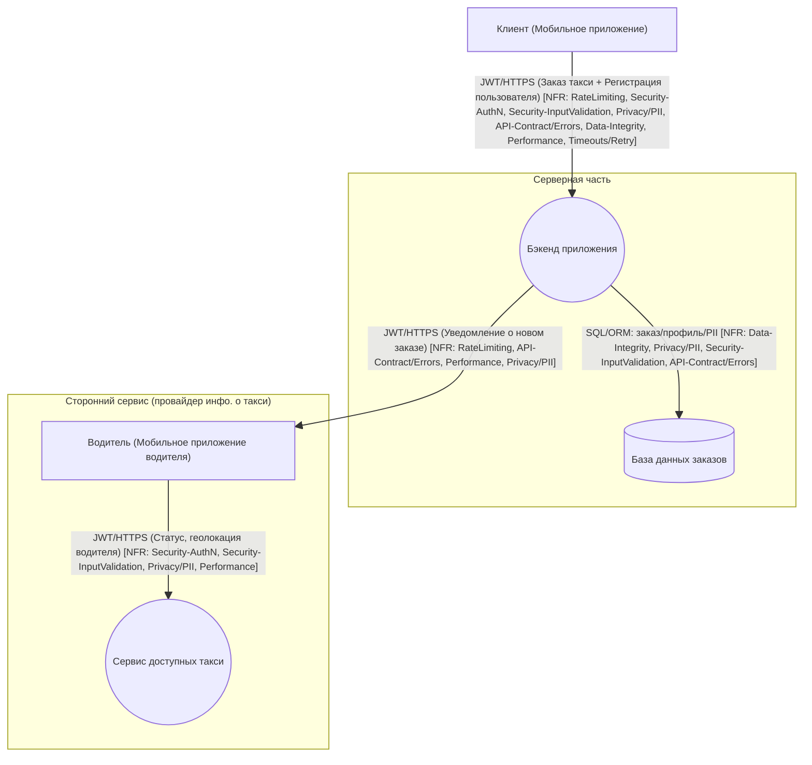

```mermaid

flowchart TD
%%{init: {'themeVariables': {'fontSize':'10px'}, 'flowchart': {'nodeSpacing': 50, 'rankSpacing': 50}} }%%
    %% DFD диаграмма приложения такси (5 узлов)
    %% Бэкенд и база данных объединены в один серверный блок

    %% Внешние сущности
    A["Клиент (Мобильное приложение)"]

    %% Контейнер серверной части
    subgraph S[Серверная часть]
        P1((Бэкенд приложения))
        D[(База данных заказов)]
    end

    %% Вспомогательные сервисы
    subgraph P["Сторонний сервис (провайдер инфо. о такси)"]
        P3((Сервис доступных такси))
        B["Водитель (Мобильное приложение водителя)"]
    end

    %% Потоки данных
    A -->|"JWT/HTTPS (Заказ такси + Регистрация пользователя) [NFR: RateLimiting, Security-AuthN, Security-InputValidation, Privacy/PII, API-Contract/Errors, Data-Integrity, Performance, Timeouts/Retry]"| P1

    %% Потоки к базе данных (внутри сервера)
    P1 -->|"SQL/ORM: заказ/профиль/PII [NFR: Data-Integrity, Privacy/PII, Security-InputValidation, API-Contract/Errors]"| D

    %% Водительские взаимодействия
    B -->|"JWT/HTTPS (Статус, геолокация водителя) [NFR: Security-AuthN, Security-InputValidation, Privacy/PII, Performance]"| P3
    P1 -->|"JWT/HTTPS (Уведомление о новом заказе) [NFR: RateLimiting, API-Contract/Errors, Performance, Privacy/PII]"| B
```
