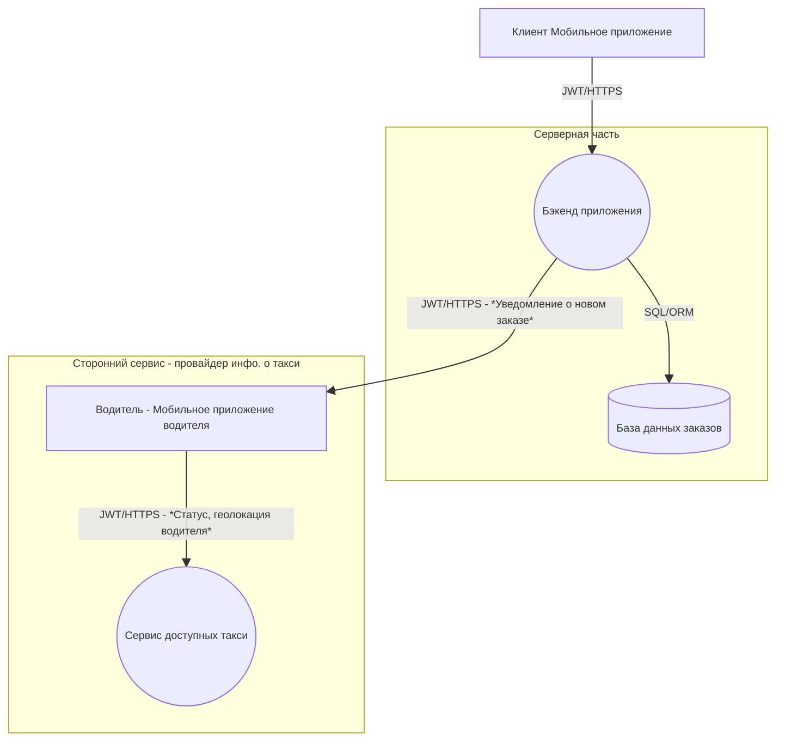

```mermaid

flowchart TD
%%{init: {'themeVariables': {'fontSize':'10px'}, 'flowchart': {'nodeSpacing': 50, 'rankSpacing': 50}} }%%
    %% DFD диаграмма приложения такси (5 узлов)
    %% Бэкенд и база данных объединены в один серверный блок

    %% Внешние сущности
    A[Клиент Мобильное приложение]

    %% Контейнер серверной части
    subgraph S[Серверная часть]
        P1((Бэкенд приложения))
        D[(База данных заказов)]
    end

    %% Вспомогательные сервисы
    subgraph P[Сторонний сервис - провайдер инфо. о такси]
        P3((Сервис доступных такси))
        B[Водитель - Мобильное приложение водителя]
    end

    %% Потоки данных
    A -->|JWT/HTTPS| P1

    %% Потоки к базе данных (внутри сервера)
    P1 -->|SQL/ORM| D

    %% Водительские взаимодействия
    B -->|JWT/HTTPS - *Статус, геолокация водителя*| P3
    P1 -->|JWT/HTTPS - *Уведомление о новом заказе*| B

```
