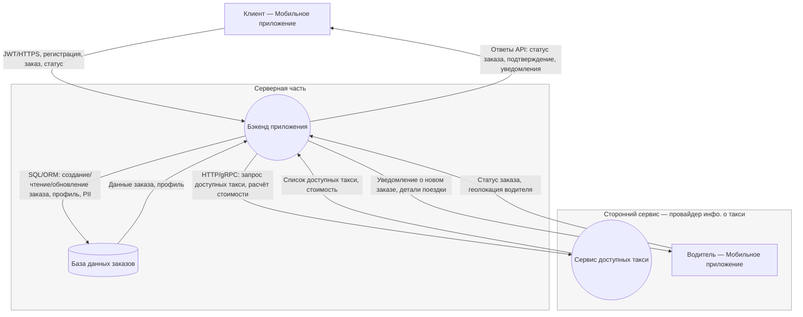

```mermaid
flowchart TD
    %% DFD диаграмма приложения такси (5 узлов)
    %% Бэкенд и база данных объединены в один серверный блок

    %% Внешние сущности
    A[Клиент — Мобильное приложение]

    %% Контейнер серверной части
    subgraph S[Серверная часть]
        P1((Бэкенд приложения))
        D[(База данных заказов)]
    end

    %% Вспомогательные сервисы
    subgraph P[Сторонний сервис — провайдер инфо. о такси]
        P3((Сервис доступных такси))
        B[Водитель — Мобильное приложение]
    end

    %% Потоки данных
    A -- "JWT/HTTPS, регистрация, заказ, статус" --> P1
    P1 -- "Ответы API: статус заказа, подтверждение, уведомления" --> A

    %% Потоки к базе данных (внутри сервера)
    P1 -- "SQL/ORM: создание/чтение/обновление заказа, профиль, PII" --> D
    D -- "Данные заказа, профиль" --> P1

    %% Водительские взаимодействия
    P1 -- "Уведомление о новом заказе, детали поездки" --> B
    B -- "Статус заказа, геолокация водителя" --> P1

    %% Внешний сервис такси
    P1 -- "HTTP/gRPC: запрос доступных такси, расчёт стоимости" --> P3
    P3 -- "Список доступных такси, стоимость" --> P1

    classDef boundary fill:#f6f6f6,stroke:#999,stroke-width:1px;
    class S,P boundary;
```
